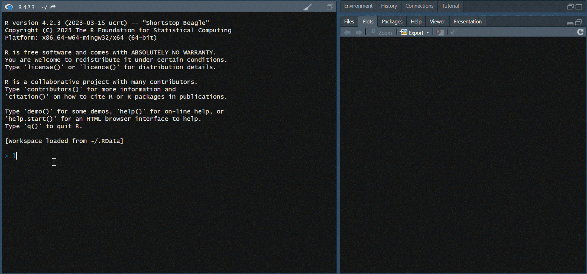

# vivainsights R package

The **vivainsights** R package is an open-source repository of more than 100 functions that provide curated, pre-built analyses on top of Viva Insights queries. Analysts can use this package to execute custom analyses that go beyond the insights that Viva Insights [templates](../analyst/templates/introduction-to-templates.md) and [custom queries](person-query.md) make available. These analyses can help leaders go deeper into the data that Viva Insights provides to solve more specific problems.

For the detailed package documentation, go to the [package website](https://microsoft.github.io/vivainsights/).

The **vivainsights** library is published on the [Comprehensive R Archive Network (CRAN)](https://cran.r-project.org/web/packages/vivainsights/index.html).

>[!Note]
> R is an [open-source statistical programming language](https://www.r-project.org/about.html) and one of the most popular toolkits for data analysis and data science. For users of the R language, a "package" is a unit of sharable code that's organized into libraries. For users of Python, we also have a package with similar features written in Python. 

## Capabilities for analysts

This R package is intended for use by analysts and data scientists who are intermediate-to-advanced users of R, across all the stages of data exploration and analysis. With the **vivainsights** R package, you can:

* Run prebuilt analyses and visualizations of Viva Insights data, which let you create settings to use organizational data variables and maintain privacy thresholds.
* Obtain outputs in multiple formats. Easily export outputs into several formats, including clipboard (copy and paste), Excel, .csv, and—for plots—.png, .svg, and .pdf.
* Validate data prior to analysis by running a data validation report. To improve the quality and reliability of analysis, this report systematically checks, for example, metrics, organizational attributes, and meeting subject lines to find patterns like public holidays, non-knowledge workers, outliers, and missing values in the data.
* Generate prebuilt interactive HTML reports for data validation, subject-line text mining, and key collaboration metrics.
* Use advanced analytics functions, like text mining and organizational network analysis (ONA), all designed specifically for Viva Insights metrics.

The following gif shows the experience of creating a visualization of collaboration hours with the **vivainsights** R package:

## Example visualizations

Here are a few more examples of the visualizations you can make with this R package: 

:::image type="content" source="../images/analyst-r-density.png" alt-text="Screenshot of a density graph for collaboration hours.":::

:::image type="content" source="../images/analyst-r-rank.png" alt-text="Screenshot of a plot that show lowest and highest group average collaboration hours by org attribute.":::

:::image type="content" source="../images/analyst-r-network-p2p.png" alt-text="Screenshot that shows a person-to-person network diagram.":::

## More about R and the vivainsights R package	

### Why should I use R to analyze data from Viva Insights?

* **Reproducibility** – Code-based workflows help facilitate reproducible analysis, which is the notion that analysis should be built in a way that is replicable by others. R as a tool promotes this good practice.  
* **Scalability** – R scales relatively well in the context of large datasets. The application of functions and automated processes also help cut down routine analysis time.
* **Integration** – If you already use R as part of your analysis toolkit, adopting the package as part of the workflow will be seamless and easy.

### How will using the vivainsights R package benefit me and my organization? 

By using the **vivainsights** R package, you can:

* Improve the speed, scalability, and reproducibility on current analysis workflow for Viva Insights. 
* Maintain a streamlined data-science workflow by integrating Viva Insights with existing R and data science workflows (for example, analyzing engagement surveys, ERP, or CRM data).
* Deliver advanced analytics proof-of-value artifacts quickly without switching to a different stack or putting in additional coding effort. 

### Is the vivainsights R package right for me?

The library is designed for analysts or data scientists who have at least a basic knowledge of R or statistical programming. R has a code-based analysis workflow, so you should be comfortable analyzing data without a graphical user interface. 

### Is the vivainsights R package free to use?

Both R and the **vivainsights** R package are open source. This means they’re free to use with no commercial licenses required. 

### What’s the difference between the vivainsights R package and Power BI templates from Viva Insights?

The **vivainsights** R package and Power BI templates Viva Insights from Viva Insights are complementary tools. In short, the **vivainsights** R package requires more technical expertise from the user, but it also has more analytical power and potential. 

Power BI dashboards are easy to set up for users with no coding background. The R package enables versatile and in-depth analysis to your Viva Insights data, providing the interface for more complex analysis like clustering and churn modeling. 

## Analyst resources

The **vivainsights** R package, its documentation, and other related resources are available on GitHub in the following locations:

* [vivainsights R package source code](https://github.com/microsoft/vivainsights/)
* [vivainsights R package documentation](https://microsoft.github.io/vivainsights/analyst_guide_intro.html), which includes a quick-start guide, code examples, and other information like the structure of the package.
* [Submit an issue or a feature request](https://github.com/microsoft/vivainsights/issues)
* [Full list of functions](https://microsoft.github.io/vivainsights/reference/index.html)

